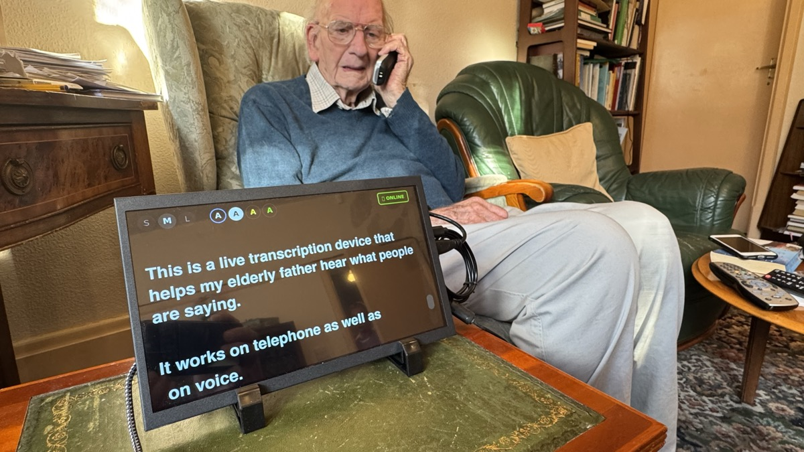

# Telephone and Conversation Transcriber

My elderly father is extremely deaf and struggles to hear people, particularly on the landline phone. So I built this — a Raspberry Pi with a 10" touchscreen that sits next to his phone and transcribes conversations in near real-time, so he can read what people are saying.

It picks up both phone calls (via a USB telephone recorder tapped into the landline) and in-room conversation (via a USB conference microphone), and displays live captions in large, clear text. When nobody's talking it shows a nice flip-clock. The whole thing runs headless as a systemd service — plug it in and it just works.



## Easy Install

Got your Raspberry Pi set up with Raspberry Pi OS? Just run this one line:

```bash
curl -sSL https://raw.githubusercontent.com/andygmassey/telephone-and-conversation-transcriber/main/install.sh | bash
```

Then open **http://gramps.local:8080** on your phone or computer. The setup page will walk you through the rest — picking your microphones and getting everything running. The whole thing takes about 5 minutes.

> **New to Raspberry Pi?** See the [step-by-step guide](docs/building-sd-image.md) for how to set up your Pi from scratch, including how to get WiFi working.

## What You'll Need

### The computer

Any Raspberry Pi from the list below will work, but which one you need depends on how you want to use it:

| Raspberry Pi | Cloud services | Offline (no internet) | Price |
|---|---|---|---|
| **Pi 5 (8 GB)** — recommended | Works great | Works great | ~$80 |
| **Pi 5 (4 GB)** | Works great | Works, but a bit slower | ~$60 |
| **Pi 4 (8 GB)** | Works great | Works, but noticeably slower | ~$55 |
| **Pi 4 (4 GB)** | Works great | Struggles — cloud recommended | ~$55 |
| **Pi 4 (2 GB)** | Works great | Not recommended | ~$45 |

**What's the difference?** When you use a cloud service (like Deepgram or Groq), most of the hard work happens on the internet, so even a cheaper Pi works fine. If you want it to work without internet, the Pi needs to do all the speech recognition itself, which needs more power.

**If you're buying new**, get the **Pi 5 with 8 GB** — it handles everything well and gives you the most flexibility.

You'll also need:

- **A USB-C power supply** for the Pi (~$12). Important: use the official Raspberry Pi power supply or one rated for 27W (5V/5A). Regular phone chargers don't provide enough power and cause problems.
- **A microSD card**, 32 GB or larger (~$8)

### The screen

Any HDMI touchscreen will work. I used a 10.1" screen (1280x800) that cost about $33. Bigger is better since the whole point is to read the captions easily.

### The room microphone

A **USB conference microphone** works best because it picks up sound from all directions — the person can sit anywhere nearby and it'll hear them. I used the [TONOR G11](https://www.amazon.com/dp/B07GVGMW59) (~$30), which picks up voices clearly from about 3.5 metres away and plugs straight into the Pi with USB. Most USB conference microphones will work.

### The phone recorder (optional)

If you want to transcribe landline phone calls too, you'll need a **USB telephone recorder** that plugs into the phone line and the Pi. I used [this one from Taobao](https://intl.taobao.com/sk/_b.PbsIYe) (~$17) — search for "USB telephone recorder RJ-11" on Amazon or AliExpress for alternatives. It connects between the wall socket and the phone with a standard phone cable, so it hears both sides of the conversation. Most USB telephone recorders with an RJ-11 connection will work.

### Total cost

| Part | Approximate cost |
|---|---|
| Raspberry Pi 5 (8 GB) | $80 |
| Official USB-C power supply | $12 |
| 32 GB microSD card | $8 |
| 10" HDMI touchscreen | $33 |
| USB conference microphone | $30 |
| USB phone recorder (optional) | $20 |
| **Total** | **~$163** (or ~$143 without phone recorder) |

## How Setup Works

You don't need to type anything on the touchscreen. Here's how it goes:

1. **Prepare the SD card on your computer** — you use a free app called [Raspberry Pi Imager](https://www.raspberrypi.com/software/) to put the operating system on the SD card. During this step, you'll type in your WiFi name and password — this is the only time you need to enter them.
2. **Plug everything in** — put the SD card in the Pi, connect the screen, microphone(s), and power.
3. **Run the installer** — either plug in a keyboard or connect from another computer via SSH, and paste the one-line install command. It does everything automatically.
4. **Finish setup on your phone** — open **http://gramps.local:8080** in your phone's browser. The setup page will walk you through picking your microphones and choosing a speech service. No need to touch the Pi's screen at all.
5. **Done** — the touchscreen starts showing live captions. Plug it in and it just works from now on.

## Features

- **Live Captions** — real-time speech-to-text displayed on a touchscreen
- **7 Cloud Services** — Deepgram, AssemblyAI, Azure, Groq, Interfaze, OpenAI Whisper, Google Cloud
- **3 Offline Engines** — Faster Whisper, Vosk, Whisper.cpp — works even without internet
- **Dual Audio Sources** — transcribes both landline phone calls and in-room conversation
- **Flip-Clock Display** — split-flap style clock when idle, auto-dims at night
- **Touch Controls** — font size (S/M/L), colour schemes, drag-to-scroll history
- **Auto Phone Detection** — automatically switches to phone audio when a call begins
- **Bulletproof Reliability** — watchdog timers, auto-restart, health monitoring
- **Web Setup Wizard** — configure everything from your phone at `http://gramps.local:8080`

## Language Support

The transcriber is primarily built and tested with **English (British English)**, but most of the speech engines support many other languages. The setup wizard currently defaults to English — changing the language requires editing `caption_app.py` (we'd welcome a PR to add language selection to the wizard).

| Engine | Languages | Notes |
|---|---|---|
| **Deepgram** | 36+ | Very good English, with support for Spanish, French, German, Hindi, and many more |
| **AssemblyAI** | 99+ | Wide language coverage |
| **Azure Speech** | 100+ | Excellent multilingual support |
| **Google Cloud** | 125+ | Widest language coverage |
| **OpenAI Whisper** | 50+ | Good multilingual support |
| **Groq** (Whisper) | 50+ | Same as OpenAI Whisper |
| **Interfaze** | Not tested | Likely multilingual — feedback welcome |
| **Faster Whisper** (offline) | 50+ | Same languages as Whisper |
| **Vosk** (offline) | 20+ | Needs a separate model download per language — see [Vosk models](https://alphacephei.com/vosk/models) |
| **Whisper.cpp** (offline) | 50+ | Same languages as Whisper |

> **Non-English users:** If you try this in another language, we'd love to hear how it goes! Please [open an issue](https://github.com/andygmassey/telephone-and-conversation-transcriber/issues) to share your experience — it helps others.

## Cloud Services Compared

The setup wizard lets you choose from 7 different cloud speech services. Here's how they compare:

| Service | Speed | Free tier | Cost after free tier | Best for |
|---|---|---|---|---|
| **Deepgram** | Instant | $200 credit on signup | ~$0.004/min | Best all-round choice |
| **AssemblyAI** | Instant | 100 hours free | ~$0.006/min | Great accuracy |
| **Azure Speech** | Instant | 5 hours/month free forever | ~$0.01/min | If you already use Microsoft |
| **Groq** | Few seconds delay | Free (~8 hours/day) | Free | Free and very good |
| **Interfaze** | Few seconds delay | Pay as you go | ~$0.003–0.009/min | Low cost |
| **OpenAI Whisper** | Few seconds delay | Pay as you go | ~$0.006/min | If you already use OpenAI |
| **Google Cloud** | Few seconds delay | $300 new account credit | ~$0.006/min | If you already use Google |

**"Instant" vs "few seconds delay"** — The top three services show words on screen as they're being spoken, almost in real-time. The bottom four send audio in short batches, so words appear a few seconds after they're said. Both work well — it just depends whether you need to follow a fast conversation or are happy with a slight delay.

## Usage

### Display Modes

**Clock Mode (idle):** Split-flap style clock appears after 90 seconds of silence. Auto-dims between 22:00-07:00.

**Caption Mode (active):** Automatically switches when speech is detected.

### Touch Controls

- **S / M / L** — change font size
- **Colour circles** — switch colour scheme (white/black, black/white, yellow/black, green/black)
- **ONLINE / OFFLINE** — toggle between cloud and offline engines
- **Drag** — scroll through caption history
- **Escape** — exit application (if you've plugged in a keyboard)

### Phone Calls

When a landline call is detected via the USB phone recorder, the system automatically:
1. Switches to phone audio input
2. Shows a phone icon in the caption bar
3. Switches back to room mic after 10 seconds of silence

## Manual Setup (Advanced)

If you prefer to set things up by hand, or the easy installer doesn't work for your setup:

### 1. Set up Python environment

```bash
python3 -m venv ~/gramps-env --system-site-packages
source ~/gramps-env/bin/activate
pip install vosk sounddevice numpy websocket-client flask requests
# Optional: pip install faster-whisper scipy
# Optional: pip install azure-cognitiveservices-speech
```

### 2. Download Vosk model (offline fallback)

```bash
cd ~
wget https://alphacephei.com/vosk/models/vosk-model-small-en-gb-0.15.zip
unzip vosk-model-small-en-gb-0.15.zip
mv vosk-model-small-en-gb-0.15 vosk-uk
```

### 3. Configure credentials

```bash
cp credentials.py.example credentials.py
# Edit credentials.py with your API key
```

### 4. Install systemd services

```bash
mkdir -p ~/.config/systemd/user
cp systemd/caption.service ~/.config/systemd/user/
cp systemd/gramps-mute.service ~/.config/systemd/user/
systemctl --user daemon-reload
systemctl --user enable --now caption gramps-mute
```

### 5. Install system watchdogs (optional, requires root)

```bash
sudo cp scripts/caption-watchdog.sh /usr/local/bin/
sudo cp scripts/display-watchdog.sh /usr/local/bin/
sudo cp scripts/network-watchdog.sh /usr/local/bin/
sudo chmod +x /usr/local/bin/*-watchdog.sh
sudo cp systemd/caption-watchdog.service systemd/caption-watchdog.timer /etc/systemd/system/
sudo cp systemd/display-watchdog.service systemd/display-watchdog.timer /etc/systemd/system/
sudo cp systemd/network-watchdog.service systemd/network-watchdog.timer /etc/systemd/system/
sudo systemctl daemon-reload
sudo systemctl enable --now caption-watchdog.timer display-watchdog.timer network-watchdog.timer
```

## Architecture

```
┌─────────────────┐     ┌─────────────────┐
│ Phone Recorder  │     │ Room Microphone  │
│ (USB, 8kHz)     │     │ (USB, 16kHz)    │
└────────┬────────┘     └────────┬────────┘
         │                       │
         └───────────┬───────────┘
                     │
              ┌──────▼──────┐
              │ Cloud STT   │  ← 7 providers
              │     OR      │
              │ Offline STT │  ← 3 engines
              └──────┬──────┘
                     │
              ┌──────▼──────┐
              │   PyQt6     │
              │  Fullscreen │
              └──────┬──────┘
                     │
              ┌──────▼──────┐
              │ Touchscreen │
              └─────────────┘
```

## Files

| File | Purpose |
|------|---------|
| `caption_app.py` | Main application — UI, transcription, phone switching |
| `mute_helper.py` | Phone activity detector — monitors USB recorder |
| `install.sh` | One-line installer for fresh Raspberry Pi |
| `setup/` | Web setup wizard (Flask app on port 8080) |
| `credentials.py.example` | Template for API credentials |
| `scripts/` | System watchdog scripts |
| `systemd/` | Service files for auto-start and monitoring |
| `docs/` | Additional guides (SD card image, etc.) |

## Troubleshooting

### No captions appearing

1. Check microphone levels:
   ```bash
   amixer -c 0 sget Mic  # Phone mic
   amixer -c 1 sget Mic  # Room mic
   ```

2. Check service status:
   ```bash
   systemctl --user status caption.service
   ```

3. Check audio devices are connected:
   ```bash
   arecord -l
   ```

4. Restart service:
   ```bash
   systemctl --user restart caption.service
   ```

### Service keeps crashing

```bash
journalctl --user -u caption.service -f
```

### Microphone recording silence

Check the mute button LED on the microphone:
- **LED ON** = Microphone active (working)
- **LED OFF** = Microphone muted (no audio)

Try unplugging and replugging the USB cable.

### Can't access the setup page

- Make sure you're on the same WiFi network as the Pi
- Try the Pi's IP address instead: `http://192.168.x.x:8080` (check your router for the Pi's address)
- Make sure the setup service is running: `systemctl --user status gramps-setup`

## Reliability Features

### Application Level
- Thread-safe state management
- Automatic engine fallback (online → offline if cloud fails)
- Health monitoring with auto-restart (max 5 attempts)
- Stale transcription detection (restarts after 2 min silence)
- Phone detection with device handoff

### System Level
- systemd watchdog integration (Type=notify)
- Caption service watchdog timer (checks every 60s)
- Display watchdog timer (restarts LightDM, reboots if needed)
- Network watchdog timer (pings gateway every 2 min, restarts WiFi)
- LightDM aggressive restart policy

## Updating

To update to the latest version:

```bash
cd ~/gramps-transcriber
git pull
systemctl --user restart caption
```

Or just run the installer again — it's safe to run multiple times.

## License

MIT License - see [LICENSE](LICENSE) for details.
